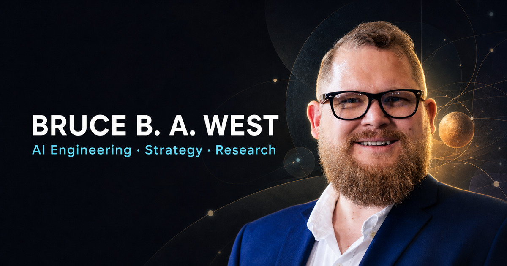

  

  <strong>I build the systems that turn AI ambition into accountable, adopted capability.</strong>

  AI engineering &nbsp;·&nbsp; Product and enterprise strategy &nbsp;·&nbsp; Organizational transformation &nbsp;·&nbsp; Independent research

  
  
  
  

---

<table>
  <tr>
    <td width="33%" valign="top">
      <h3>BUILD</h3>
      
AI products, platforms, knowledge systems, and operating mechanisms that turn consequential problems into measurable capability.

    </td>
    <td width="33%" valign="top">
      <h3>TRANSFORM</h3>
      
Strategy, adoption, governance, workflows, incentives, and decision rights that help useful innovation scale and endure.

    </td>
    <td width="33%" valign="top">
      <h3>RESEARCH</h3>
      
Inquiry into accountable AI, knowledge infrastructure, organizational systems, networks, and human judgment.

    </td>
  </tr>
</table>

## Current work

- Leading AI/ML teams, architecture, product direction, engineering strategy, and executive alignment for high-consequence systems.
- Connecting technical delivery to the organizational machinery around it: evidence, workflows, governance, incentives, skills, and adoption.
- Building an independent research practice designed to connect theory, fieldwork, and implementation.
- Publishing working ideas on the systems that determine whether innovation becomes real capability.

## Selected impact

| **$80M–$120M** | **73%** | **$50M+** | **~30%** |
|:---|:---|:---|:---|
| Projected annual savings from AI-enabled infrastructure decision support | Faster launches through repeatable cloud-readiness mechanisms | Annual revenue enabled through product governance and operational execution | Enterprise delivery-efficiency improvement |

## Latest Field Notes

<!-- FIELD-NOTES:START -->
<table>
  <tr>
    <td width="22%" valign="top"><code>JUL 29, 2026</code> AI ENGINEERING · 9 MIN</td>
    <td valign="top"><a href="https://brucebawest.com/blog/the-first-deliverable-from-generative-coding-should-be-understanding/"><strong>The first deliverable from generative coding should be understanding</strong></a> Federal modernization will gain more from generative coding systems when they first make legacy estates legible—mapping dependencies, preserving rationale, and exposing risk before proposing change.</td>
  </tr>
  <tr>
    <td width="22%" valign="top"><code>JUL 17, 2026</code> CYBERSECURITY · 13 MIN</td>
    <td valign="top"><a href="https://brucebawest.com/blog/the-cmmc-pause-is-an-organizational-knowledge-test/"><strong>The CMMC suspension is an organizational knowledge test</strong></a> The CMMC Phase II suspension lowers the immediate pressure of third-party certification, but it does not remove the obligation to protect defense data—or the need to preserve the organizational knowledge built around that work.</td>
  </tr>
  <tr>
    <td width="22%" valign="top"><code>JUL 15, 2026</code> AI STRATEGY · 4 MIN</td>
    <td valign="top"><a href="https://brucebawest.com/blog/from-signals-to-strategic-options/"><strong>From signals to strategic options</strong></a> How agentic AI can help turn scattered external change into evidence-backed innovation options without replacing strategic judgment.</td>
  </tr>
</table>
<!-- FIELD-NOTES:END -->

<a href="https://brucebawest.com/blog/"><strong>Explore all Field Notes →</strong></a>

## Explore the practice

| Route | What you will find |
|:---|:---|
| [**Projects**](https://brucebawest.com/projects/) | Public-safe case studies showing how strategy, engineering, research, and organizational change meet in the work. |
| [**Executive background**](https://brucebawest.com/resume/) | The operating range behind the work: engineering fluency, business judgment, and research discipline. |
| [**Research practice**](https://brucebawest.com/research/) | Current questions and emerging work across accountable AI, organizational systems, and human–AI collaboration. |
| [**Xendev Labs**](https://xendevlabs.com/) | Independent experimentation, research, and capability-building. |

## Credibility, in the words of people who have seen the work

> “What stood out to me immediately was the altitude of his thinking, the originality that he brought into discussions, and his potential for AI leadership.” 
> — **Chris Huber Reitz**, Senior Director, Enterprise AI

> “Very few possess his potent combination of technical depth, business acumen, and thirst for growth.” 
> — **Rohit Talluri**, Co-founder & CEO, Primitive Labs; former Amazon AGI + AWS

> “Bruce possesses a rare blend of technical talent mixed with a high degree of emotional intelligence and inspiring leadership skills.” 
> — **Sunny Ahmed**, Associate Director, Partner Sales; former AWS global alliance leader

<a href="https://brucebawest.com/#recommendations">Read the full recommendations</a>

---

  <strong>Building serious AI—or studying what makes it work?</strong> 
  <a href="https://brucebawest.com/contact/">Send a direct inquiry</a>

<!-- profile-readme: BruceBAWest -->
